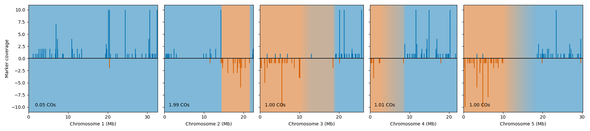

## **snco**: <ins>s</ins>ingle <ins>n</ins>ucleus <ins>c</ins>ross<ins>o</ins>ver analysis

`snco` is a set of tools for identifying recombination events at the single nucleus/cell level, using read alignments and/or SNP data from single nucleus sequencing experiments of recombinant haploid gametes. Reads alignments or SNPs are summarised into a per-cell barcode "marker" dataset which can then be used to perform crossover analysis with a hidden Markov model. `snco` also provides commands for generating per-barcode summary statistics, plotting marker and crossover profiles, and simulating ground truth datasets using marker distributions from real data.

`snco` is still under active development, so expect some bugs and changes! If in doubt about the behaviour of `snco` or how it might change, feel free to reach out by opening an issue!

### **sneqtl**: <ins>s</ins>ingle <ins>n</ins>ucleus <ins>e</ins>xpression <ins>q</ins>uantitative <ins>t</ins>rait <ins>l</ins>ocus analysis

`snco` also ships with `sneqtl`, a submodule for performing expression QTL analyses on single gamete sequencing datasets using the haplotypes generated by `snco`. This is currently still under development.

### Installation:

The easiest way to install `snco` is using the `conda` yaml provided:

```
git clone https://github.com/schneebergerlab/snco.git
cd snco
conda env create -f snco.yaml
```

alternatively, you can install it using pip:

```
pip install git+https://github.com/schneebergerlab/snco.git
```

`snco` requires `torch` and `pomegranate>=1.0` for performing crossover detection, `pysam` and `joblib` for bam file manipulation and `numpy`, `pandas`, `scipy` and `matplotlib` for general marker analysis and plotting. The command line interface is build using `click`. For `sneqtl` and some of the provided helper scripts, `scikit-learn` and `parasail` are also required.

### Quickstart:

`snco` divides the analysis into several subcommands for modular and flexible workflows. There are currently two different methods provided for loading markers into the format used for crossover prediction. These are: 

* `snco loadbam`: read a bam file aligned with cell barcode and haplotype alignment tags. Currently the best way to generate this is to run `STAR solo` in Diploid alignment mode. This is a mode of `STAR` where reads can be aligned to two different haploid genomes at once. See the [`STAR` manual](https://github.com/alexdobin/STAR/blob/master/doc/STARmanual.pdf) and detailed `snco loadbam` documentation (coming soon) for further information.
* `snco loadcsl`: read a matrix market + vcf file describing biallelic SNP counts for individual cells, generated by [`cellsnp-lite`](https://github.com/single-cell-genetics/cellsnp-lite). The reference allele is assumed to derive from haplotype 1, and the alternative allele from haplotype 2.

The output of both load commands is a json file containing marker information, which can be fed into the downstream `clean`, `predict`, `stats` and `plot` commands.

If you would like to perform the full analysis in a single step, then the core analysis pipeline, `load(+clean)+predict`, can be run together as a single command using `snco bam2pred` or `snco csl2pred`.

Please see the documentation pages (coming soon...) for a full list of commands and their options.

### Python API

`snco` also provides an API with some helpful classes for working with output marker and predictions datasets in python. These are the `MarkerRecords` and `PredictionRecords` classes:

```
from snco import MarkerRecords, PredictionRecords

co_markers = MarkerRecords.read_json('markers.json')
co_preds = PredictionRecords.read_json('pred.json')

co_markers.barcodes[:5]

    ['TGGTTAGGTAGATTGA',
     'ACGTAGTTCATCAGTG',
     'GACCAATCAACAAAGT',
     'CTATAGGGTTACCTTT',
     'AGAGAATCAGACAATA']
```

Plotting functions can also accessed both from the command line using `snco plot` and also in python using the `snco.plot` module or built in methods of `MarkerRecords`/`PredictionRecords`

```
co_markers.plot_barcode('TGGTTAGGTAGATTGA', co_preds=co_preds, max_yheight=10);
```


